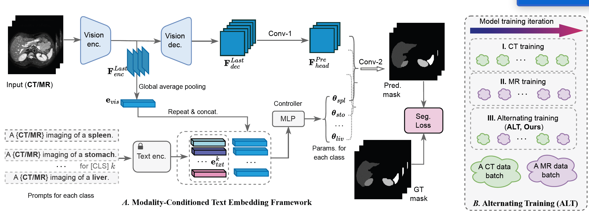

# MulModSeg
MulModSeg: Enhancing Unpaired Multi-Modal Medical Image Segmentation with Modality-Conditioned Text Embedding and Alternating Training (WACV2025)

## Data Preprocessing
- Please follow [this reference](https://github.com/yhygao/CBIM-Medical-Image-Segmentation) regarding your original conversion datasets, such as resampling, cropping, and padding operations.
## For Training and Testing 
- For additional baseline models, please refer to [this link](https://github.com/yhygao/CBIM-Medical-Image-Segmentation).
## Contact
- Chengyin Li, cyli@wayne.edu
